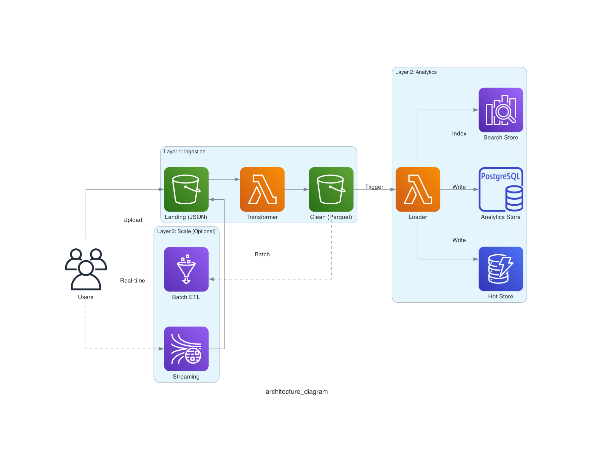

# AWS JSON to Parquet Analytics Pipeline

A reference implementation for a scalable, serverless data ingestion and analytics pipeline on AWS.



## Overview

This repository demonstrates a production-grade pattern for ingesting high-volume JSON logs, converting them into optimized Parquet logs, and making them available for analytics across multiple storage engines (S3, DynamoDB, Postgres, and OpenSearch).

It is designed as a **learning reference** for cloud engineers, focusing on realistic trade-offs, error handling, and component decoupling, rather than being a "click-to-deploy" SaaS product.

### The Problem

Ingesting raw JSON logs at scale directly into a data warehouse or search engine can be prohibitively expensive and slow.
- **Raw JSON** is verbose and slow to query.
- **Direct inserts** to databases (like Postgres) hit connection limits and write bottlenecks.
- **Search engines** (like OpenSearch) are expensive for long-term retention.

### The Solution

This pipeline implements a "Lake House" approach:
1.  **Ingest Cheaply**: Land raw logs in S3.
2.  **Optimize**: Asynchronously convert JSON to Parquet (columnar storage) for 10x-100x query performance and cost savings.
3.  **Fan Out**: Selectively load data into:
    - **DynamoDB** for hot item lookups (by ID).
    - **RDS Postgres** for relational analytics and aggregations.
    - **OpenSearch** for free-text search and discovery.

## Architecture Deep Dive

This repository implements a "Lake House" architecture. Below is the rationale for each layer, helping you understand *why* enterprises build this way.

### Layer 1: Core Ingestion (The Foundation)
**"The Data Lake"**
*   **What it is**: Raw JSON logs land in S3, are validated, and converted to compressed Parquet.
*   **Why use it**: S3 is the cheapest, most durable storage available. Parquet format reduces file size by ~90% and speeds up analytics queries by 10x compared to JSON.
*   **When to use**: **ALWAYS.** This is your "Source of Truth". Even if you load data into Postgres later, you keep the Parquet files as a disaster recovery backup and for ad-hoc machine learning or historical analysis that doesn't fit in a database.
*   **Enterprise Context**: In a large corp, this is the "Raw" and "Trusted" zone. Data Engineers manage this; Data Scientists query it directly using tools like Athena or Spark.

### Layer 2: Analytics & Indexing (The Serving Layer)
**"The Data Marts"**
*   **What it is**: Subsets of high-value data are loaded into specialized engines.
    *   **Postgres (RDS)**: For relational aggregations (e.g., "Daily active users by region").
    *   **OpenSearch**: For text search (e.g., "Find all error logs containing 'Timeout'").
    *   **DynamoDB**: For instant key-value lookups (e.g., "Get latest session state for User X").
*   **Why use it**: Querying S3 (Athena) has latency (seconds/minutes). Databases provide sub-second responses for dashboards and applications.
*   **When to use**: When you need to serve data to **end-users** (dashboards) or **applications** (APIs). Don't dump *everything* here—only what's queried frequently.
*   **Enterprise Context**: These are "Data Marts" or "Operational Data Stores". They are expensive, so you curate the data that goes in.

### Layer 3: Scale & Operations (The Enterprise Hardening)
**"The Big Data Pipe"**
*   **What it is**: Decoupling ingestion from processing using streams and batch jobs.
    *   **Kinesis**: Buffers incoming data so a spike in traffic doesn't crash your API.
    *   **Glue (Spark)**: Processes data in massive batches rather than small real-time chunks (compaction).
*   **Why use it**: Lambda functions drift into "Small File Problem" (creating thousands of tiny Parquet files) at high scale, which kills query performance. Glue compacts these into large, efficient files.
*   **When to use**: When you exceed ~1,000 events/second or need complex joins during transformation.
*   **Enterprise Context**: This is standard for "Streaming Ingestion" and "ETL Offloading".

---

## How to Run Each Layer

### Layer 1 & 2 (Locally)
The local runner simulates the flow of Layer 1 (Transform) and Layer 2 (Load).
1.  **Start Services**: `cd local && docker compose up -d` (Starts Layer 2 targets)
2.  **Run Pipeline**: `python local/runner.py` (Runs Layer 1 transform -> Layer 2 load)

### Layer 1 (AWS)
Deploy Terraform with the standard target (Lambda + S3).
```bash
terraform apply -target=aws_s3_bucket.landing_zone -target=aws_lambda_function.transformer
```
**Cost**: Very Low (Free Tier eligible for small volumes).

### Layer 2 (AWS)
Uncomment `analytics.tf` and deploy.
```bash
terraform apply
```
**Cost**: **Moderate**. RDS and OpenSearch run on hourly instances, not per-request. Destroy when not in use.

### Layer 3 (AWS)
Uncomment `scale.tf`.
**Cost**: **High** (Kinesis Shards + Glue DPUs). Use only if you understand the pricing.

## Repository Structure

```
├── infra/              # Terraform infrastructure as code
├── services/           # Application code
│   ├── ingestion/      # Log ingestion logic
│   ├── transform/      # JSON to Parquet conversion
│   └── loader/         # Loaders for downstream stores
├── local/              # Local development utilities (Docker, Runners)
├── docs/               # Architecture diagrams and design notes
└── tools/              # Helper scripts
```

## Getting Started

### Prerequisites
- Python 3.11+
- Terraform 1.5+
- Docker & Docker Compose
- AWS CLI (configured)

## Detailed Usage Guide

### 1. Local Development (The "Zero Cost" Way)

Run the entire pipeline on your machine to understand the flow.

**Prerequisites:** Docker, Python 3.11+, Make or Bash.

**Setup:**
1.  Initialize environment:
    ```bash
    ./tools/setup_local.sh
    source .venv/bin/activate
    ```
2.  Start Analytics Stores (Postgres & OpenSearch):
    ```bash
    cd local && docker compose up -d
    ```
    *Wait 30 seconds for OpenSearch to initialize.*

**Run the Pipeline:**
Run the runner script. This will:
1.  Generate 1000 dummy JSON logs in `data/landing`.
2.  Convert them to Parquet in `data/clean` using the transformation service.
3.  Load the data into your local Postgres and OpenSearch.

```bash
python local/runner.py
```

### 2. Verification Steps

**Verify Parquet Output:**
```bash
ls -R data/clean
# You should see partitioned folders: year=YYYY/month=MM/day=DD/logs_....parquet
```

**Verify Postgres Data:**
Connect to local Postgres:
```bash
PGPASSWORD=analytics_password psql -h 127.0.0.1 -U analytics_user -d analytics_db -c "SELECT count(*) FROM usage_analytics;"
```

**Verify OpenSearch Data:**
Check index count:
```bash
curl -k -u admin:StrongPassword123! https://127.0.0.1:9200/app-logs/_count
```

## Deployment Layers

### Layer 1: Ingestion (Production Ready)
Deploy the core infrastructure:
```bash
cd infra/terraform
terraform init
terraform apply -target=aws_s3_bucket.landing_zone -target=aws_s3_bucket.clean_zone -target=aws_lambda_function.transformer
```

### Layer 2: Analytics (Cost Warning)
To deploy RDS and OpenSearch, uncomment the blocks in `infra/terraform/analytics.tf`.
**Warning**: This will incur hourly costs (~$0.05 - $0.20/hr).

### Layer 3: Scale
Configuration for Kinesis and Glue is available in `infra/terraform/scale.tf` but commented out by default.

## Project Structure Deep Dive

- `services/ingestion`: (Concept) API Gateway -> Kinesis/S3.
- `services/transform`: The heart of the pipeline. `main.py` contains the logic to convert NDJSON to Parquet using Pyarrow. It is designed to run both locally and as a Lambda function.
- `services/loader`: Python scripts that can be deployed as Lambdas to load data from S3 into downstream stores.


## Design Decisions & Trade-offs

- **Parquet vs. CSV/JSON**: Parquet is chosen for its columnar handling, compression, and schema enforcement. It is the de-facto standard for modern data lakes.
- **Lambda vs. Glue**: For real-time/near-real-time event driven processing of small batches, Lambda is faster and cheaper. Glue is preferred for massive batch jobs (TB+). We start with Lambda for simplicity.
- **Terraform State**: Local state is used for this reference. In production, use an S3 backend with DynamoDB locking.

## Cost & Limits
- **S3**: Standard costs apply. Lifecycle rules should be added to transition Raw data to Glacier after x days.
- **Lambda**: The transformation function is memory intensive (requires loading PyArrow). 512MB-1GB is recommended.
- **RDS/OpenSearch**: These are the most expensive components. For non-production usage, ensure you verify the `db.t3.micro` or serverless offerings.
